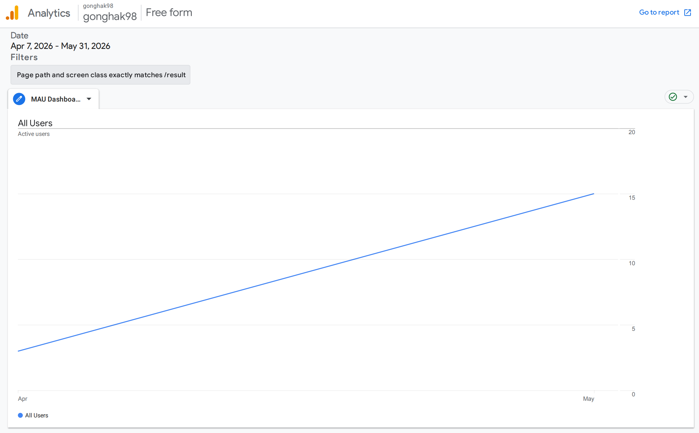
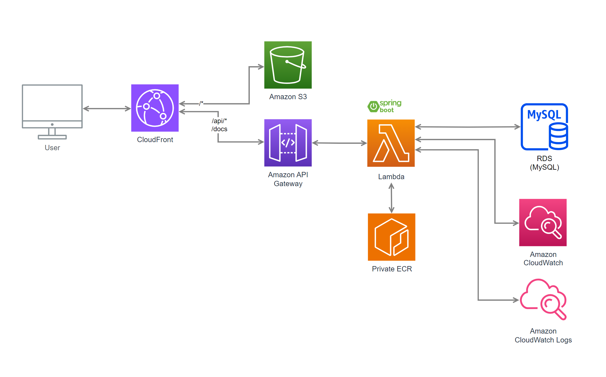
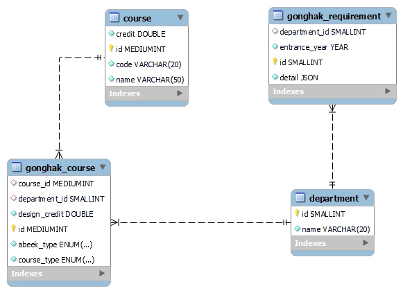

# gonghak98 : 세종대학교 공학인증 패스

세종대학교 공학인증 패스는 기이수 성적표 하나로 세종대학교 공학인증 요건을 충족하는지 확인할 수 있는 웹 서비스입니다.
**24년 9월부터 4개월 간 4개 학과(전자정보통신공학과, 컴퓨터공학과, 소프트웨어학과, 데이터사이언스학과)를 대상으로 180명 이상의 가입자 수를 확보했던 서비스를 새롭게
리뉴얼**했습니다.

## 서비스 성과(MAU)

본 서비스의 MAU는 실제 성적표 업로드를 통해 결과를 받아본 활성 사용자 수를 기준으로 설정하였습니다.

| 지표명                     | 2026.04 | 2026.05 | 측정 기준                           |
|:------------------------|:-------:|:-------:|:--------------------------------|
| **MAU (활성 사용자)**        | **3명**  | **15명** | 한 달간 실제 결과를 조회한 활성 사용자 수        |
| **Monthly Views (조회수)** | **10회** | **56회** | 사용자가 API를 호출하여 결과 페이지를 로드한 총 횟수 |

> **사용자 1명당 평균 약 3회의 검사를 실시했습니다.**

## 주요 기능

### 1) 맞춤형 공학인증 ABEEK 영역별 이수현황 대시보드

기이수 성적표, 입학년도/학과 데이터를 바탕으로 사용자의 공학인증 이수현황을 대시보드 형태로 제공합니다.
**전체 이수현황, 영역별 상세 이수내역**을 바탕으로 현재 상황을 점검할 수 있습니다.

### 2) ABEEK 영역별 세부 요건을 모두 검사

각 학과별 영역 조건과 필수 선후수 조건을 검사하는 기능을 제공하고 있습니다. 단순 조회가 아닌 학과/년도별 맞춤형 검사 기능을 제공합니다.

> 전자정보통신공학과의 전공영역, 선후수 조건

## 서비스 이용방법

본 서비스는 비회원제로 운영되며, 사용자의 학사정보 ID/PW를 입력받지 않습니다.
따라서 [학사정보시스템](https://portal.sejong.ac.kr/jsp/login/loginSSL.jsp?rtUrl=portal.sejong.ac.kr/comm/member/user/ssoLoginProc.do)
에서 기이수 성적표를 다운받아야 합니다.
> 기이수 성적표에는 사용자의 학사정보가 기록되어 있지 않으며, 본 서비스도 성적표에 기재된 과목 데이터만을 추출하여 사용합니다.

## AWS 아키텍처 & ERD

## API 문서(Spring Rest Docs)

- https://gonghak98.com/docs/index.html
